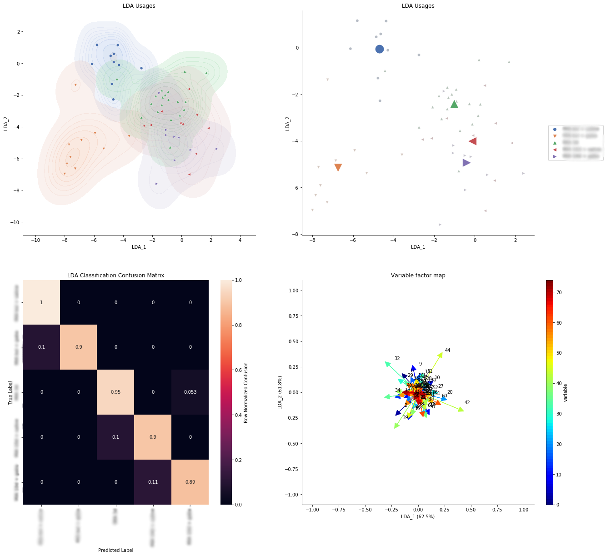

# moseq2-lda
## A framework for LDA analysis of moseq data
This package gathers some common methods and formalizes a framework for rapid execution of LDA analysis with moseq data.

## Installation
Code relies on `moseq2-viz`. Please be sure to install this dependency prior to installing this library.

Specific version of `scikit-learn` is important. This library currently prefers a newer version of scikit-learn than moseq2-viz prefers (0.20.3), but we prefer >= 0.22.3.

## Usage

### Load data
First step is to load data from a moseq model file and an index file.

```
from moseq2_lda.data import load_representations

representations = load_representations("./moseq2-index.yaml", "./my-model.p", max_syllable=70, groups=['group_A', 'group_B'])
```
Use the `groups` kwarg to limit data retrieval to only animals in the supplied groups (as specified in the moseq index file).
Use the `max_syllable` kwarg to limit data retrieval to the top `max_syllable` moseq moduels.
Use the `exclude_uuids` kwarg to exclude specific animals.

The returned representations is an object containing summarized module usage and transition probabilities, in addition to animal metadata.
The representations may be passed to modelling and plotting functions.


### Train a model
The simplest and fastest way to get started is to pass your representations to the `train_lda_pipeline` method. This is a "batteries-included" method 
which performs the following procedure:
- split the representations into `test` and `train` subsets
- creates an LDA estimator
- run a cross-validated search (k-fold stratified CV) for the hyperparameter `shrinkage` using only the `train` subset of the representations
- select the best hyperparameter value from the search, and then train the classifier using the full `train` subset of the representations
- predict on the held-out `test` subsets and print a classification report
- construct and return a `LdaPipelineResult` object

The second parameter importantly informs the pipeline of the representation type to be used as features in the LDA model. Please select from `usages`, `frames`, or `trans`.
```
from moseq2_lda.model import train_lda_pipeline

results = train_lda_pipeline(representations, 'usage')
```

### Explore a model

We can plot the validation curve for the `shrinkage` hyperparameter search completed above:
```
from moseq2_lda.viz import plot_validation_curve

plot_validation_curve(results.cv_result)
```


We can plot a permutation test score using the trained model. This permutes the representation data to generate randomized datasets. The performance of the model is evaluated on the randomized data. The method `plot_permutation_score` will plot a histogram of the model performance on the randomized data. A dashed red line indicates the score for the model with non-random data. A gray dotted line indicates the p-value, representing the fraction of randomized data sets where the estimator performed as well or better than in the original data. See https://scikit-learn.org/stable/modules/generated/sklearn.model_selection.permutation_test_score.html for more information.
```
from moseq2_lda.viz import plot_permutation_score

plot_permutation_score(results.estimator, results.data.usage, results.data.groups)
```


Finally, we can visualize the representations as they are projected into the LDA space, and look at the confusion matrix and the weighting of features in the model. Here we can use a "batteries-included" method that plots all of these things, but you may also use the individual plotting methods yourself.
```
from moseq2_lda.viz import plot_lda_results

fig, axs, df = plot_lda_results(results.estimator, representations.usage, representations.meta, representations.groups, groups, palette, markers, title='LDA Usages')
```

